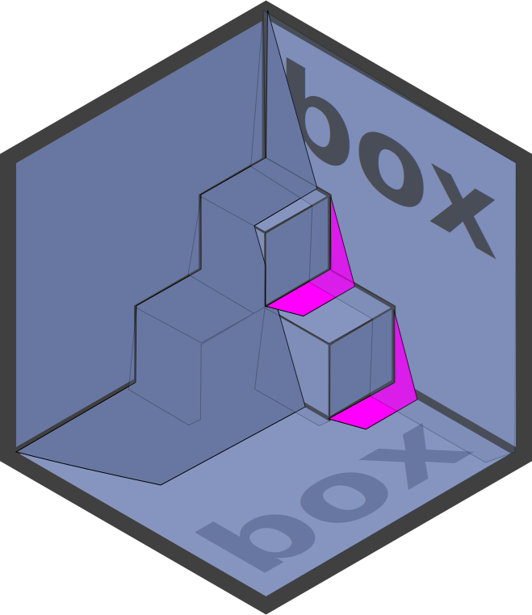

<!-- README.md is generated from README.rmd. Please edit that file instead! -->

```{r, echo = FALSE}
knitr::opts_chunk$set(
  collapse = TRUE,
  comment = '#>',
  fig.path = 'man/figures/'
)

desc = read.dcf('DESCRIPTION')
desc = setNames(as.list(desc), colnames(desc))
```

# `r desc$Package` 

> `r desc$Title`

## 📦 Installation

To install the pre-release development version:

```{r, eval = FALSE}
if (! requireNamespace('pak')) {
    install.packages("pak", repos = "https://r-lib.github.io/p/pak/dev/")
}

pak::pkg_install('klmr/box@develop')
```

## 🥜 Usage in a nutshell

‘box’ allows organising R code in a more modular way, using two complementary
mechanisms. Firstly, it allows loading just the parts of packages that are
needed, and giving imported names arbitrary aliases. This makes code more
explicit, deliberate, and reduces errors due to name clashes.

And secondly it simplifies *writing modular code* by treating files and folders
of R code as independent modules, without requiring the user to wrap reusable
code into packages.

### Loading code

‘box’ replaces the base R `library` function with `box::use`. `box::use` is more
powerful, more flexible, and less error-prone than `library`. At its simplest,
it provides a direct replacement of `library`:

Instead of

```{r eval = FALSE}
library(ggplot2)
```

You’d write

```{r, eval = FALSE}
box::use(ggplot2[...])
```

This tells R to import the ‘ggplot2’ package, and to attach all its exported
names — just like `library`. For this, `...` acts as a wildcard to denote “all
exported names”. However, attaching everything is generally discouraged, since
this practice leads to name clashes and makes it harder to retrace which
packages individual names come from.

Instead, we can also instruct `box::use` to not attach any names when loading a
package — or to just attach some. Or we can tell it to attach some names under
an alias, and we can even give the package *itself* an alias.

The following `box::use` declaration illustrates all these different cases:

```{r eval = FALSE}
box::use(
    purrr[map, map_dbl],
    tbl = tibble,
    dplyr[dp_select = select]
)
```

This declaration

* attaches the names `purrr::map` and `purrr::map_dbl`;
* creates an alias, `tbl`, for the imported ‘tibble’ package (but does not attach
any of its names directly); and
* attaches `dplyr::select` under the alias `dp_select`.

Of the three packages thus loaded, only ‘tibble’ is now available by name (as
`tbl`), and we can use its exports via the `$` subset operator, e.g.
`tbl$glimpse`. Although we’ve also loaded ‘purrr’ and ‘dplyr’, we did not create
local names for the packages themselves, we only attached some of their exported
names.

Furthermore, unlike with `library`, the effects of `box::use` are restricted to
the current scope: we can load and attach names inside a function, and after
executing the function nothing has changed on its outside: importing code
happens *locally* and *safely*, and functions which load packages no longer
cause global side effects:

```{r eval = FALSE}
log = function (msg) {
    box::use(glue[glue])
    message(glue('[LOG MESSAGE] {msg}'))
}

log('test')
# 'glue' is undefined at this point!
```

This makes it easy to write code with external dependencies without creating
accidental, far-reaching side effects.

Unlike other packages, ‘box’ itself is never loaded via `library`. Instead, its
functionality is always used explicitly via `box::use`.

### Reusable code modules

FIXME: Add section about modules.

## Why ‘box’?

‘box’ promotes a philosophy that is in some way the opposite of what’s common in
R: while some notable packages export and attach many hundreds and, in at least
one notable case, *over a thousand* names, well-established software engineering
best practices encourage limiting both the scope of names, as well as the number
of names available in each scope.

For instance, it is best practice in Python to never use the equivalent of
`library(pkg)` (which in Python is `from pkg import *`). Instead, Python
[strongly encourages][pep8] using `import pkg` or `from pkg import a, few,
symbols`, which correspond to `box::use(pkg)` and `box::use(pkg[a, few,
symbols])`, respectively.

‘box’ also makes it drastically easier to *write* reusable code: instead of
needing to create a package, each R code file *is already a module* which can be
imported using `box::use`. Modules can also be nested inside directories, such
that self-contained projects can be easily split into separate or interdependent
submodules.

For more information refer to the [Get started][] vignette.

[pep8]: https://www.python.org/dev/peps/pep-0008/#id23
[Get started]: articles/box.html
