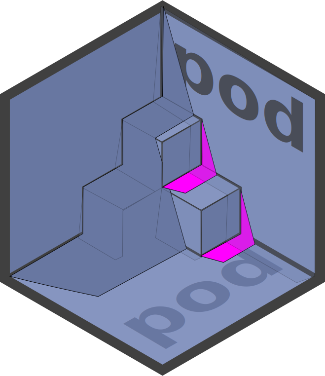

<!-- README.md is generated from README.rmd. Please edit that file instead! -->

```{r, echo = FALSE}
knitr::opts_chunk$set(
  collapse = TRUE,
  comment = '#>',
  fig.path = 'man/figures/'
)

desc = read.dcf('DESCRIPTION')
desc = setNames(as.list(desc), colnames(desc))
```

# `r desc$Package` 

> `r desc$Title`

## 📦 Installation

To install the pre-release development version:

```{r, eval = FALSE}
if (! requireNamespace('pak')) {
    install.packages("pak", repos = "https://r-lib.github.io/p/pak/dev/")
}

pak::pkg_install('klmr/pod@develop')
```

## 🥜 Usage in a nutshell

‘pod’ allows organising R code in a more modular way, using two complementary
mechanisms. Firstly, it allows loading just the parts of packages that are
needed, and giving imported names arbitrary aliases. This makes code more
explicit, deliberate, and reduces errors due to name clashes.

And secondly it simplifies *writing modular code* by treating files and folders
of R code as independent modules, without requiring the user to wrap reusable
code into packages.

### Loading code

‘pod’ replaces the base R `library` (and `require`) functions with `pod::use`.
`pod::use` is more powerful, more flexible, and less error-prone than `library`.
At its simplest, it provides a direct replacement for `library`:

Instead of

```{r eval = FALSE}
library(ggplot2)
```

You’d write

```{r, eval = FALSE}
pod::use(ggplot2[...])
```

This tells R to import the ‘ggplot2’ package, and to attach all its exported
names — just like `library`. For this purpose, `...` acts as a wildcard to
denote “all exported names”. However, attaching everything is generally
discouraged, since this practice leads to name clashes and makes it harder to
retrace which names come from which packages.

Instead, we can also instruct `pod::use` to not attach any names when loading a
package — or to just attach some. Or we can tell it to attach some names under
an alias, and we can even give the package *itself* an alias.

The following `pod::use` declaration illustrates all these different cases:

```{r eval = FALSE}
pod::use(
    purrr,
    tbl = tibble,
    dplyr[filter, select],
    stats[st_filter = filter]
)
```

This declaration

* imports the package ‘purrr’ (but does not attach any of its names);
* creates an alias, `tbl`, for the imported ‘tibble’ package (but does not
  attach any of its names);
* attaches the names `dplyr::filter` and `dplyr::select`; and
* attaches the name `stats::filter` under the alias `st_filter`.

Of the four packages thus loaded, only ‘purrr’ and ‘tibble’ are now available by
name (as `purrr` and `tbl`, respectively), and we can use their exports via the
`$` operator, e.g. `purrr$map` or `tbl$glimpse`. Although we’ve also loaded
‘dplyr’ and ‘stats’, we did not create local names for the packages themselves,
we only attached some of their exported names.

Furthermore, unlike with `library`, the effects of `pod::use` are restricted to
the current scope: we can load and attach names *inside* a function, and calling
this function will not change the available names in the calling scope (or
elsewhere). Importing code happens *locally*, and functions which load packages
no longer cause global side effects:

```{r eval = FALSE}
log = function (msg) {
    pod::use(glue[glue])
    message(glue('[LOG MESSAGE] {msg}'))
}

log('test')
# 'glue' is undefined at this point!
```

This makes it easy to write code with external dependencies without creating
unintentional, far-reaching side effects.

Unlike other packages, ‘pod’ itself is never loaded via `library`. Instead, its
functionality is always used explicitly via `pod::use`.

### Reusable code modules

With ‘pod’, code doesn’t have to be wrapped into a package to be reusable.
Instead, every regular R file forms a reusable *R module* that can be used
elsewhere via `pod::use`.

Such modules can be stored in a central path, or locally in each individual
project. To import an R module, write

```{r eval = FALSE}
pod::use(prefix/modname)
```

Unlike packages, modules always need to be qualified by a *prefix*, which forms
the full module name. The prefix must match the path of the module below the
*repository path*, or the local path.

Otherwise, modules function like packages — they define code and export names,
which `xyz::use` imports. The biggest difference to packages is ease of use:
modules encourage writing all R code to be potentially reusable. No need for
setup, separate folders, metadata or other infrastructure.

For more information refer to the *[Get started][]* vignette.

## Why ‘pod’?

‘pod’ promotes a philosophy that is in a way the opposite of what’s common in R:
while some notable packages export and attach many hundreds and, in at least one
notable case, *over a thousand* names, software engineering best practices
encourage limiting both the scope of names, as well as the number of names
available in each scope.

For instance, in Python it is best practice to never use the equivalent of
`library(pkg)` (i.e. `from pkg import *`). Instead, Python [strongly
encourages][pep8] using `import pkg` or `from pkg import a, few, symbols`, which
correspond to `pod::use(pkg)` and `pod::use(pkg[a, few, symbols])`,
respectively. The same is true in many other languages, e.g. [C++][], [Rust][],
and [Perl][]. Other languages (e.g. JavaScript and Go) are even stricter: they
don’t allow unqualified imports at all.

[*The Zen of Python*][pep20] puts this rule succinctly:

> Explicit is better than implicit.

‘pod’ also makes it drastically easier to *write* reusable code: instead of
needing to create a package, each R code file *is already a module* which can be
imported using `pod::use`. Modules can also be nested inside directories, such
that self-contained projects can be easily split into separate or interdependent
submodules.

[pep8]: https://www.python.org/dev/peps/pep-0008/#imports
[Get started]: https://klmr.me/pod/articles/pod.html
[C++]: https://isocpp.github.io/CppCoreGuidelines/CppCoreGuidelines#Rs-using
[Rust]: https://stackoverflow.com/q/23839699/1968
[Perl]: https://perldoc.perl.org/Exporter#Selecting-What-to-Export
[pep20]: https://www.python.org/dev/peps/pep-0020/
