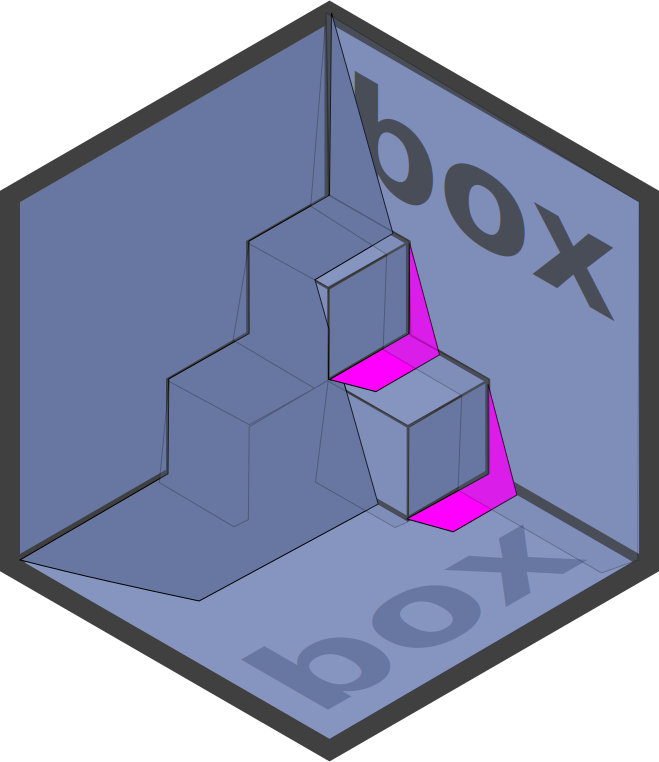

<!-- README.md is generated from README.rmd. Please edit that file instead! -->

```{r, echo = FALSE}
knitr::opts_chunk$set(
  collapse = TRUE,
  comment = '#>',
  fig.path = 'man/figures/'
)

desc = read.dcf('DESCRIPTION')
desc = setNames(as.list(desc), colnames(desc))
```

# `r desc$Package` 

> `r desc$Title`

[](https://travis-ci.org/klmr/mod)
[](https://gitter.im/klmr/mod?utm_source=badge&utm_medium=badge&utm_campaign=pr-badge&utm_content=badge)

## In a nutshell 🥜

‘xyz’ provides a better way of organising R code in a modular fashion. It allows
loading just the parts of packages that you need, and giving imported names
arbitrary aliases. And it simplifies *writing modular code* by treating files
and folders of R code as independent modules, without requiring the user to
wrap reusable code into packages.

‘xyz’ replaces `library` calls with calls to `xyz::use`. `xyz::use` is a lot
more powerful, flexible and user friendly than `library`. But at its simplest,
it offers a 1:1 replacement:

```{r eval = FALSE}
# instead of
library(ggplot2)
# write
xyz::use(ggplot2[...])
```

This tells R to import the ‘ggplot2’ package, and to attach all its exported
names — just like `library`. However, we could also instruct `xyz::use` to not
attach any names; or to just attach some. We could tell it to attach some names
under an alias. And we can give the package itself an alias.

For example:

```{r eval = FALSE}
xyz::use(
    purrr[map, map_dbl],
    tbl = tibble,
    dplyr[subset = select]
)
```

This imports and attaches `purrr::map` and `purrr::map_dbl`, creates an alias,
`tbl`, for the imported ‘tibble’ package (but does not attach any of its names
directly), and finally attaches `dlpyr::select` under the local alias `subset`.
And, although we’ve loaded ‘purrr’ and ‘dplyr’, we did not create local aliases
for them.

Unlike `library`, the effects of `xyz::use` are restricted to the current scope:
we can load and attach names inside a function, and after executing the function
nothing has changed on its outside: importing code is becoming *local* and
*safe*:

```{r eval = FALSE}
log = function (msg) {
    xyz::use(glue[glue])
    message(glue('[LOG MESSAGE] {msg}'))
}

log('test')
# 'glue' is undefined at this point!
```

This makes it easy to write code with external dependencies without creating
accidental, far-reaching side-effects.

## Why ‘xyz’?

‘xyz’ follows a somewhat opposite package philosophy from some of the rest of R,
ghotably ‘tidyverse’: Where the ‘tidyverse’ package attaches *over a thousand*
names, ‘xyz’ follows well-established software engineering practices that
dictate that a given scope should contain as few references as possible, and to
make them as explicit as possible.

For instance, it is best practice in Python to never use the equivalent of
`library(pkg)`, which is spelled as `from pkg import *`. Instead, it strongly
encourages using `import pkg` or `from pkg import some_symbol`, which correspond
to, respectively, `xyz::use(pkg)` and `xyz::use(pkg[some_symbol])`.
