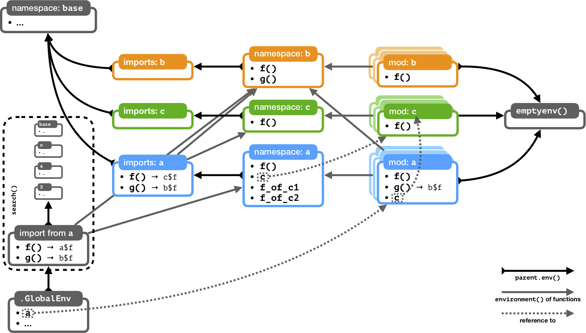

> **Note:** This document describes internal implementation details. They are not required knowledge for users of the ‘box’ package and module authors.

## Preliminaries

To ensure that module environments are properly isolates from each other, and to enable fine-grained control over imports and exports, loaded modules (as well as packages loaded via `box::use`) correspond to a mesh of several interconnected environments.

Unfortunately the exact relationship between these environments isn’t trivial, so the following document aims at explaining the gist.

Fundamentally, module environments follow a similar architecture to package environments, but they deviate in crucial ways. For a good explanation of package environments, see [*How R Searches and Finds Stuff*](https://blog.thatbuthow.com/how-r-searches-and-finds-stuff/) by Suraj Gupta, and [*Environments*](http://adv-r.had.co.nz/Environments.html) in *Advanced R* by Hadley Wickham. The following assumes that the reader has a more than passing familiarity with these concepts.

When speaking of “package environments” above and in the following, this refers to packages as handled by base R and the R package namespace functionality. For packages that are loaded by `box::use`, the rules are the same as for modules.

Let’s now consider an example of several loaded modules, and how they interact.

## An example

This example will use three modules — the minimum number necessary to show some of the interactions of the module environments. Let’s define these three modules. We’ll do so in inverse order of their usage:

### <code><span style="background: #1DB100; color: white; padding: 0 5px; border-radius: 2px;">c.r</span></code>

```{r}
#' @export
f = function () "c$f"
```

Module `c` defines and exports one name, the function `f`.

### <code><span style="background: #FF9300; color: white; padding: 0 5px; border-radius: 2px;">b.r</span></code>

```{r eval = FALSE}
#' @export
f = function () "b$f"

g = function () "b$g"
```

Module `b` defines and exports the function `f`, and in addition defines the function `g`.

### <code><span style="background: #00A2FF; color: white; padding: 0 5px; border-radius: 2px;">a.r</span></code>

```{r eval = FALSE}
#' @export
box::use(./b[g = f, ...])

box::use(./c[...])

#' @export
box::use(./c)

#' @export
f = function () "a$f"

f_of_c1 = c$f
f_of_c2 = get('f', parent.env(environment()))
stopifnot(identical(f_of_c1, f_of_c2))
```

Module `a` imports and re-exports all names from `b` (changing the name of `b$f` to `g`); it also imports, but does not re-export, all names from `c` (and, additionally, defines an alias for the module, which it exports).

It further defines and exports the function `f` and defines, but does not export, the functions `f_of_c1` and `f_of_c2` (which are defined such that they are identical to each other — hopefully it will become clear why later).

Finally, let’s use the modules by executing the following code:

```{r eval = FALSE}
box::use(a = ./a[f, g])
```

Now the name `a` is defined in `.GlobalEnv` and refers to the module environment of module `a`. The exported names `f` and `g` of `a` are also available in `.GlobalEnv` (but not defined *inside* `.GlobalEnv`).

The loaded modules can be represented by the following schematic, with each box corresponding to an environment:



Let’s go over the different types of environment associated with each module, and how they are connected.

## Environments

### Module namespace

Modules are loaded into their own dedicated environment, the *module namespace*. Every name that is defined by a module is defined inside it. It is thus also the enclosing environment of the module’s functions. Lastly, the module namespace also stores meta-information about the module in a hidden member named `.__module__.`.

This corresponds to the package namespace.

### Module imports environment

The parent environment of the module namespace is the imports environment, which contains all the names that a module imports via attachment declarations in `box::use` expressions.

The parent environment of the imports environment is the R `base` namespace environment. The module imports environment thus corresponds to the package imports environment.

### Module export environment

The module export environment, also called just “module environment” in the code base, contains all names that are marked as exported by a module. If users create a module alias in their `box::use` call, the alias will be a reference to this environment.

Similarly, attached names are selected as a subset from the module export environment (then copied into the imports environment).

There is no direct equivalent to this environment in R packages, because R packages do not distinguish between exported names and names imported by the code that loaded the package. By contrast, ‘box’ needs to distinguish the set of exports from the set of names that are imported (= “attached”) by client code.

### Importing into other environments

Module import environments store imports from one or more module into another. However, modules can also be imported from inside the global environment, or from inside functions, which have their own local execution environment (the stack frame). When this happens, a new imports environment is created on the fly, and attached to the importing environment’s `parent.env` chain. Calling `box::use` with a non-empty attach list in `.GlobalEnv` is therefore similar to calling `library`. In particular, inside `.GlobalEnv` the call `box::use(pkg[...])` in pretty much equivalent to calling `library(pkg)`, and is discouraged for the same reason that `library(pkg)` is discouraged.
